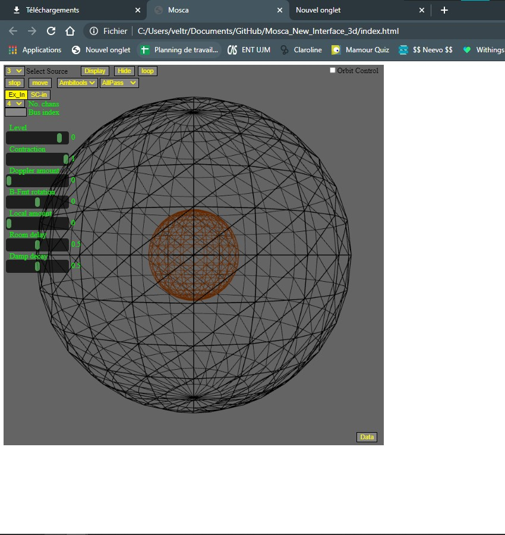

### New in 1.2.0
- Adding a "Console" div next to interface, see [commands](#command-implemented)
- Remove non-used files
- clear button work

---

# Mosca New 3D Interface

## Description

This interface work with [Mosca](https://github.com/escuta/mosca). The original interface was create in 2D with Supercollider.
This one is create using P5js and give a 3d interface for the users. This interface works with Node JS to create the local server you must link this interface with Mosca program on Supercollider.
The interface is an **Alpha version** and some features are not available, or don't work correctly.

## Get Started

First you need to download [NodeJs](https://nodejs.org/en/download) for run local server. 
When Node is on your computer, go to the folder which contain mosca interface and run this command in a terminal:
`node socketServer.js`.You can start Mosca in SuperCollider. Now you just have to open the *index.html* file.

### Some controls
 You can choose the source you want to move by select it in the select bar on the top left. Then the sources reprented by a black sphere turn cyan. You can move it by click near
 the source with your mouse. You can move on the 3 axis (X,Y,Z), you can move on Y axis by maintain the `y` key and drag your mouse horizontally.

---

###Command implemented
\level
\position (WIP)

> position only give *x* position 

\doppler
\contraction
